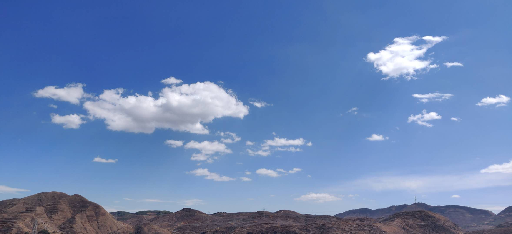
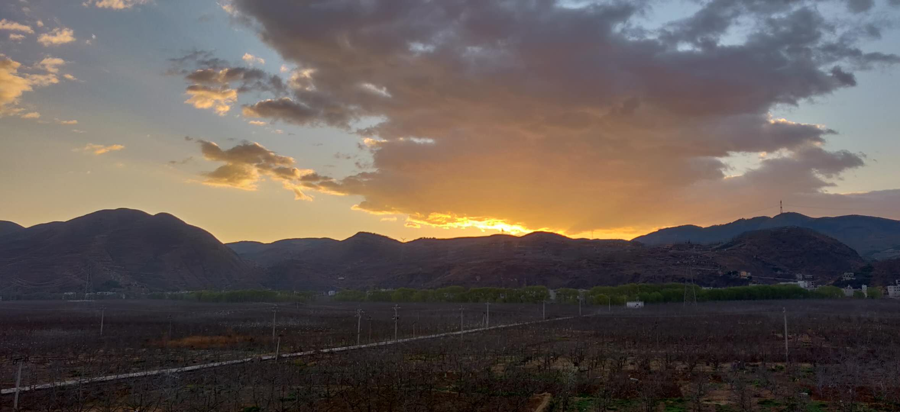
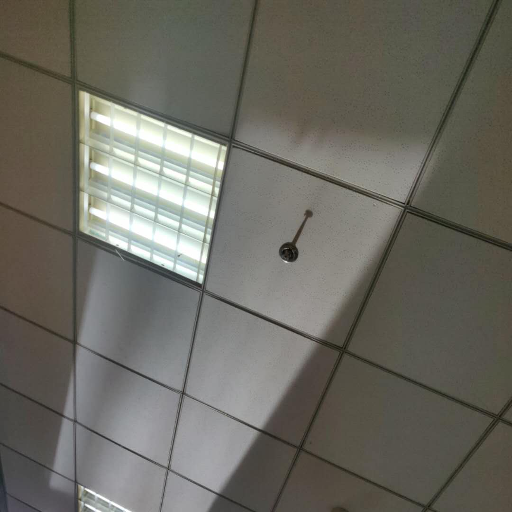
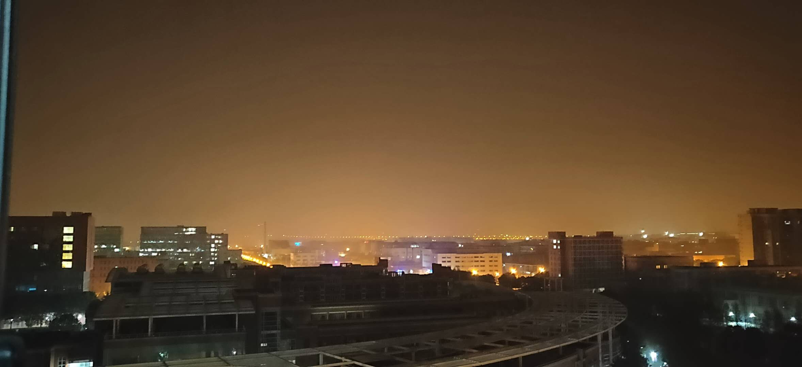

# 随笔

风亲吻了湖面，水波笑开了花  
风亲吻了柳树，柳枝高兴地跳起舞  
风亲吻了风，然后一起吻向我脸庞

2019-10-24

把外套反过来穿，像是为世界披件外衣

2019-10-22

路上，为一个可爱动人的身影驻足 ​​​​

2019-10-17

有一个人剥橘子用嘴吃，周围人便用鼻子吃  

2019-9-27

恍然意识到，对于未来的人们而言，此时的每个人都在书写自己的或参与别人的历史。

当绿灯的数字比平常更小，你加快速度，过了马路，你感觉像是把时间甩在了身后 ​​​​

2019-9-17

流浪的云

含苞待放的光 ​​​​

2019-9-8

如果雨滴触碰大地是死亡，树叶可以延缓他们的衰老。 

2019-8-25

我都剃成短发了，地铁站警察还是要查我的身份证😒

2019-7-6

骚扰电话啊啊啊啊，打断了我的梦，像是打断一部电影，剧情正缓慢展开的时候，突然停止播放，而且再也无法继续播放了😴太遗憾了，像是少了一段经历，像是剥夺了我的一段生命 ​​​

2019-7-6 09:59

我不想去动物园，我不想那么真切地看到鲜活的动物以及囚禁它们的笼子。 ​​​​

2019-7-5

蚊子真是可恶，吸我血的时候舒服着它痒着我，拍死它的时候反倒流着我的血[哼]

2019-6-21

白天，阳光透过窗  
洒在灯管上  
不知  
是谁照亮谁

2019-6-12

在黑暗中待久一点，昏暗的灯光也会刺眼

台灯很亮，顶部积了好些灰尘
眼睛，心，思想
是不是也有许多灰尘 ​​​​

2019-6-5

在屋子里来回踱步，我其实并不是要丈量房子，不过屋子有九步宽🙄

2019-4-16 20:40

天空灰蒙蒙的，地上还是繁星一片

2019-4-7 01:29

今天走路上班，发现一个秘密  
原来在春天也会有树掉下许多落叶

2019-3-28 23:44

当我站在窗前，阳光照着窗外的树梢与飞鸟，照着遛狗的路人，照着推婴儿车的妈妈，照着骑自行车的男人，也照着我。

2019-3-23 12:02

两岁的外甥女是国王  
外婆，妈妈，爸爸，外公与舅舅  
都是最忠心的侍仆，大臣和守卫  
一切美好先让国王过目，留存或是毁灭  
一切心情任由国王定夺  
在这个国家  
只有专政  
没有谁企图谋反  
他们都比国王年长  
他们都曾是国王

——致外甥女

2019-3-18 04:17

“呲呲呲”，是火种在浸入水中的一刻发出的生命中最后的呐喊​​

2018-8-20 22:48

